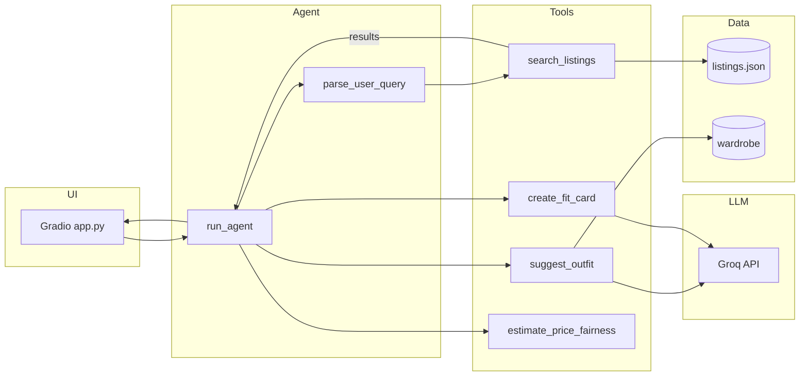

# ThriftThread — Technical Documentation

**Project name:** ThriftThread  
**Assignment:** AI201 Week 2 — FitFindr (multi-tool AI agent)  
**Stack:** Python 3.14 · Groq (`llama-3.3-70b-versatile`) · Gradio · pytest

---

## 1. Overview

ThriftThread is an agentic thrift-shopping assistant. A user types a natural-language query; the system:

1. Parses intent (item description, size, budget)
2. Searches a mock listings database
3. Suggests outfits using the user's wardrobe (or general advice)
4. Generates a shareable "fit card" caption

The agent uses a **deterministic planning loop** — the LLM is only called inside individual tools (`suggest_outfit`, `create_fit_card`), not for tool selection.

---

## 2. Fork

This project was forked from:

**[jamjamgobambam/ai201-project2-fitfindr-starter](https://github.com/jamjamgobambam/ai201-project2-fitfindr-starter)**

**Inherited from starter:**
- `data/listings.json` — 40 mock listings
- `data/wardrobe_schema.json` — wardrobe format + example/empty wardrobes
- `utils/data_loader.py` — `load_listings()`, `get_example_wardrobe()`, `get_empty_wardrobe()`
- `requirements.txt` base dependencies

**Implemented in this project:**
- `tools.py` — all tool functions
- `agent.py` — session state + planning loop
- `app.py` — Gradio UI handler
- `planning.md`, `tests/`, documentation

---

## 3. Architecture



### Request lifecycle

```
User query
    → handle_query() [app.py]
    → run_agent() [agent.py]
        → parse_user_query()
        → search_listings()        [tools.py — local JSON]
        → estimate_price_fairness() [tools.py — local JSON]
        → suggest_outfit()         [tools.py — Groq]
        → create_fit_card()        [tools.py — Groq]
    → Map session → 3 UI panels
```

---

## 4. Session object

`run_agent()` returns a `dict` with this schema:

```python
{
    "query": str,                    # original user text
    "parsed": {
        "description": str,
        "size": str | None,
        "max_price": float | None,
    },
    "search_results": list[dict],    # all matches, ranked
    "selected_item": dict | None,    # search_results[0]
    "price_assessment": dict | None, # from estimate_price_fairness
    "wardrobe": dict,
    "outfit_suggestion": str | None,
    "fit_card": str | None,
    "error": str | None,             # set on early exit
}
```

**Success:** `error is None`, all three outputs populated.  
**Search failure:** `error` set, `selected_item` / `outfit_suggestion` / `fit_card` are `None`.

---

## 5. Tool reference

### `search_listings(description, size=None, max_price=None)`

**Algorithm:**
1. Load listings via `load_listings()`
2. Filter: `price <= max_price` (if set), size token match (if set)
3. Score each listing by weighted keyword overlap:
   - Title match: +3 per term
   - Style tag match: +2 per term
   - Description/category match: +1 per term
4. Drop score-0 listings; sort by score desc, then price asc

**Returns:** `list[dict]` — empty list on no match.

---

### `suggest_outfit(new_item, wardrobe)`

**Branches:**
- `wardrobe["items"]` empty → prompt asks for general styling staples
- Otherwise → prompt lists wardrobe pieces by name and asks for named combinations

**LLM:** Groq `llama-3.3-70b-versatile`, temperature `0.75`, system message as stylist persona.

**Returns:** non-empty `str` always (on API success).

---

### `create_fit_card(outfit, new_item)`

**Guard:** empty/whitespace `outfit` → returns error string immediately (no LLM call).

**LLM:** temperature `1.1` for caption variety.

**Returns:** 2–4 sentence casual caption mentioning item name, price, platform once each.

---

### `estimate_price_fairness(new_item)` *(stretch)*

**Algorithm:**
1. Find same-category listings (exclude self)
2. Prefer those sharing a style tag; relax to category-only if < 3 tag matches
3. Compute median price; compare:
   - `≤ 0.85× median` → `great_deal`
   - `0.85–1.15×` → `fair`
   - `> 1.15×` → `overpriced`
4. `< 3 comparables` → `unknown`

**Returns:** dict, never raises.

---

## 6. Query parser

`parse_user_query()` in `agent.py` uses regex (no LLM):

| Pattern | Extracted |
|---------|-----------|
| `under $30`, `below 40`, `less than $25`, `$30` | `max_price` |
| `size M`, `in size 8` | `size` |
| `XXS`, `XS`, `XL`, `XXL`, `XXXL` standalone | `size` |
| Remaining text (minus filler phrases) | `description` |

Single-letter sizes (`S`, `M`, `L`) require explicit `size` keyword to avoid false positives in conversational text.

---

## 7. UI (`app.py`)

**Gradio layout:** one query box, wardrobe radio, three read-only output panels.

| Panel | Session source |
|-------|----------------|
| Top listing | `selected_item` + `price_assessment.message` |
| Outfit idea | `outfit_suggestion` |
| Fit card | `fit_card` |

On `session["error"]`: error in panel 1, panels 2–3 empty.

**Launch:** `python app.py` → default `http://localhost:7860`

---

## 8. Data models

### Listing (`data/listings.json`)

```json
{
  "id": "lst_006",
  "title": "Graphic Tee — 2003 Tour Bootleg Style",
  "description": "...",
  "category": "tops",
  "style_tags": ["graphic tee", "vintage", "streetwear"],
  "size": "L",
  "condition": "good",
  "price": 24.0,
  "colors": ["black"],
  "brand": null,
  "platform": "depop"
}
```

### Wardrobe item (`data/wardrobe_schema.json`)

```json
{
  "id": "w_001",
  "name": "Baggy straight-leg jeans, dark wash",
  "category": "bottoms",
  "colors": ["dark blue", "indigo"],
  "style_tags": ["denim", "streetwear", "baggy"],
  "notes": "High-waisted, sits above the hip"
}
```

---

## 9. Testing

```bash
pytest tests/ -v
```

**11 tests** in `tests/test_tools.py`:

| Test | What it verifies |
|------|------------------|
| `test_search_finds_graphic_tees` | Happy search returns results |
| `test_search_no_matches_returns_empty_list` | Failure mode: `[]` |
| `test_search_respects_max_price` | Price filter |
| `test_search_size_filter` | Size filter |
| `test_suggest_with_wardrobe` | LLM path (mocked) |
| `test_suggest_empty_wardrobe` | Empty wardrobe branch |
| `test_fit_card_happy_path` | Caption generation (mocked) |
| `test_fit_card_empty_outfit` | Empty outfit guard |
| `test_fit_card_whitespace_only` | Whitespace guard |
| `test_price_verdicts` | great_deal / fair / overpriced |
| `test_price_unknown_category` | Unknown verdict |

LLM calls are mocked via `monkeypatch` on `tools._groq_client` — no API key needed for tests.

---

## 10. Environment variables

| Variable | Required | Description |
|----------|----------|-------------|
| `GROQ_API_KEY` | Yes (for UI/CLI with LLM) | From [console.groq.com](https://console.groq.com) |

Copy `.env.example` → `.env`. Never commit `.env` (listed in `.gitignore`).

---

## 11. Troubleshooting

| Problem | Fix |
|---------|-----|
| `GROQ_API_KEY missing` | Create `.env` with valid Groq key |
| Port 7860 in use | Stop other Gradio apps or set `demo.launch(server_port=7861)` |
| Empty search for valid query | Broaden description or raise `max_price` |
| `UnicodeEncodeError` on Windows terminal | Set `$env:PYTHONIOENCODING="utf-8"` |
| Tests fail on import | Activate venv: `.venv\Scripts\activate` |

---

## 12. Name rationale — ThriftThread

**ThriftThread** was chosen because it captures what the agent does:

- **Thrift** — secondhand shopping, the core domain
- **Thread** — clothing, and the idea of *threading* data through tools (search → outfit → fit card)

The assignment name **FitFindr** remains in course materials; **ThriftThread** is this repo's project branding. Either name is fine to use in your demo narration.

**Other names considered:**

| Name | Vibe |
|------|------|
| RackRunner | Fast agent scanning the rack |
| SecondStyle | Secondhand + styling |
| FitScout | Scouts deals and outfits |
| FitFindr | Official assignment name (use for grading clarity) |

---

## 13. Files map

| File | Responsibility |
|------|----------------|
| `agent.py` | `run_agent`, `parse_user_query`, `_blank_session` |
| `tools.py` | All four tools + Groq client helper |
| `app.py` | Gradio UI + `handle_query` |
| `planning.md` | Pre-code design spec |
| `DEMO_SCRIPT.md` | Video recording script |
| `README.md` | Submission-facing overview |
| `DOCUMENTATION.md` | This file |

---

## 14. Publishing your fork

```bash
cd E:\AI201\w2
git init
git add .
git commit -m "ThriftThread: FitFindr multi-tool agent implementation"
# Create repo on GitHub named thriftthread or ai201-project2-fitfindr
git remote add origin https://github.com/YOUR_USER/thriftthread.git
git branch -M main
git push -u origin main
```

Update the fork table in `README.md` with your actual repo URL before submitting.
