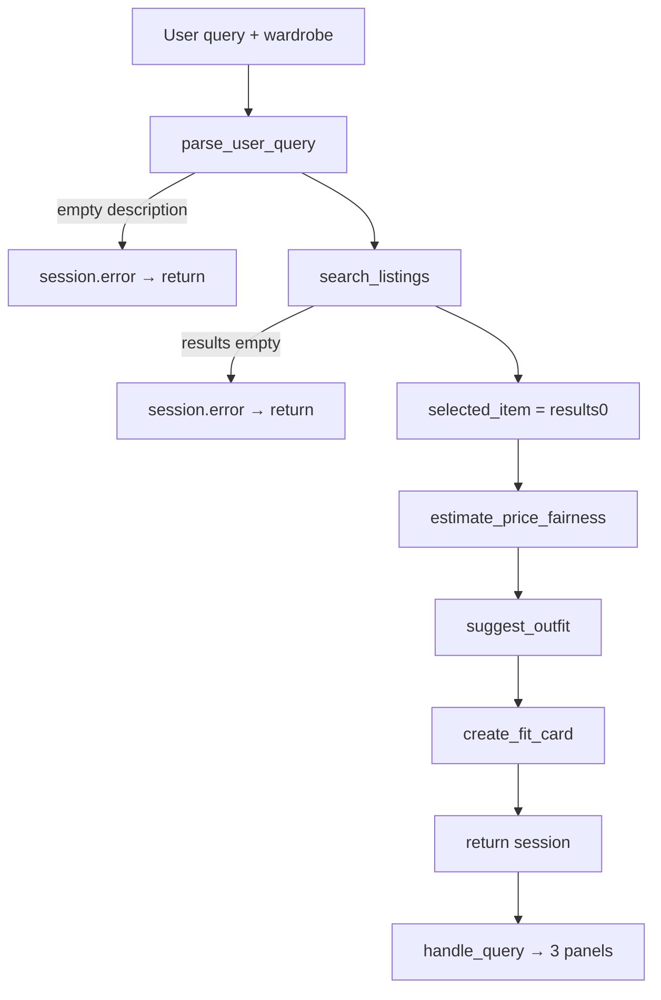

# FitFindr — planning.md

> **Project:** FitFindr (AI201 Week 2)  
> **Forked from:** [jamjamgobambam/ai201-project2-fitfindr-starter](https://github.com/jamjamgobambam/ai201-project2-fitfindr-starter)

> Design doc written before implementation. Updated when stretch features were added.

---

## Tools

### Tool 1: `search_listings`

**What it does:** Searches the mock listings JSON for items matching a text description, with optional size and price ceiling filters. Results are ranked by relevance.

**Input parameters:**
- `description` (`str`) — what the user wants, e.g. `"vintage graphic tee"`.
- `size` (`str | None`) — filter token; `"M"` matches `"S/M"`. `None` skips size filter.
- `max_price` (`float | None`) — inclusive max price. `None` skips price filter.

**What it returns:** `list[dict]` of listing records (`id`, `title`, `description`, `category`, `style_tags`, `size`, `condition`, `price`, `colors`, `brand`, `platform`), sorted best-match first. Empty list when nothing matches.

**Failure mode:** Returns `[]`. Agent sets `session["error"]` and stops — does not call downstream tools.

---

### Tool 2: `suggest_outfit`

**What it does:** Uses Groq LLM to propose 1–2 outfits pairing the selected listing with wardrobe pieces, or general styling advice when the wardrobe is empty.

**Input parameters:**
- `new_item` (`dict`) — listing from search.
- `wardrobe` (`dict`) — `{ "items": [ ... ] }` per `wardrobe_schema.json`.

**What it returns:** Non-empty `str` with outfit ideas.

**Failure mode:** Empty wardrobe → general advice prompt (no crash, no empty string).

---

### Tool 3: `create_fit_card`

**What it does:** LLM generates a 2–4 sentence casual caption for social sharing.

**Input parameters:**
- `outfit` (`str`) — text from `suggest_outfit`.
- `new_item` (`dict`) — listing for name/price/platform context.

**What it returns:** Caption `str`, or an error-message `str` if `outfit` is blank.

**Failure mode:** Empty outfit → descriptive string, no exception.

---

### Tool 4: `estimate_price_fairness` *(stretch)*

**What it does:** Compares listing price to same-category comparables in the dataset (deterministic, no LLM).

**Input parameters:** `new_item` (`dict`)

**What it returns:** `{ verdict, item_price, median_comparable, sample_size, message }` where `verdict` is `great_deal | fair | overpriced | unknown`.

**Failure mode:** Fewer than 3 comparables → `verdict="unknown"`, never raises.

---

## Planning Loop

The agent (`run_agent`) runs a **linear pipeline** with two early-exit branches:

1. **Init** — `_blank_session(query, wardrobe)`.
2. **Parse** — `parse_user_query()` → `session["parsed"]`. If `description` is empty → set `error`, return.
3. **Search** — `search_listings(...)`. If `[]` → set `error`, return (skip outfit + fit card).
4. **Select** — `selected_item = search_results[0]`.
5. **Price check** — `estimate_price_fairness(selected_item)` → `price_assessment` (always continues).
6. **Outfit** — `suggest_outfit(selected_item, wardrobe)` → `outfit_suggestion`.
7. **Fit card** — `create_fit_card(outfit_suggestion, selected_item)` → `fit_card`.
8. **Return** session.

Termination: parse failure, empty search, or all tools complete.

---

## State Management

One `session` dict per interaction:

| Field | Writer | Reader |
|-------|--------|--------|
| `query` | init | parser |
| `parsed` | parse step | search |
| `search_results` | search | select + error branch |
| `selected_item` | select | outfit + fit card |
| `price_assessment` | price tool | UI |
| `wardrobe` | init | outfit |
| `outfit_suggestion` | outfit | fit card |
| `fit_card` | fit card | UI |
| `error` | early exits | UI |

Tools never call each other directly — only through session fields.

---

## Error Handling

| Tool | Failure | Agent response |
|------|---------|----------------|
| `search_listings` | No matches | `error` message with search echo + suggestions; outfit/card stay `None` |
| `suggest_outfit` | Empty wardrobe | General styling advice; pipeline continues |
| `create_fit_card` | Empty outfit | Error string in fit-card panel |

---

## Architecture

---

## AI Tool Plan

**Milestone 3 — tools:** Use Cursor/Claude with one tool spec at a time from this doc. Verify filters, empty-list behavior, and LLM guards before moving on. Run `pytest tests/`.

**Milestone 4 — agent + app:** Provide Planning Loop + Architecture sections and `agent.py` scaffold. Verify early exits and that `selected_item` flows into both LLM tools without re-prompting.

---

## A Complete Interaction

**Query:** `"I'm looking for a vintage graphic tee under $30. I mostly wear baggy jeans and chunky sneakers."`

1. **Parse** → `{ description: "vintage graphic tee I mostly wear baggy jeans and chunky sneakers", size: None, max_price: 30 }`
2. **search_listings** → ranked list of tees ≤ $30; e.g. bootleg graphic tee at $24.
3. **select** → top result stored in `selected_item`.
4. **suggest_outfit** → pairs tee with baggy jeans + chunky sneakers from example wardrobe.
5. **create_fit_card** → casual caption mentioning Depop + $24.
6. **UI** → three panels: listing (+ price note), outfit, fit card.

**No-results path:** `"designer ballgown size XXS under $5"` → search returns `[]` → error shown, outfit/card blank.
